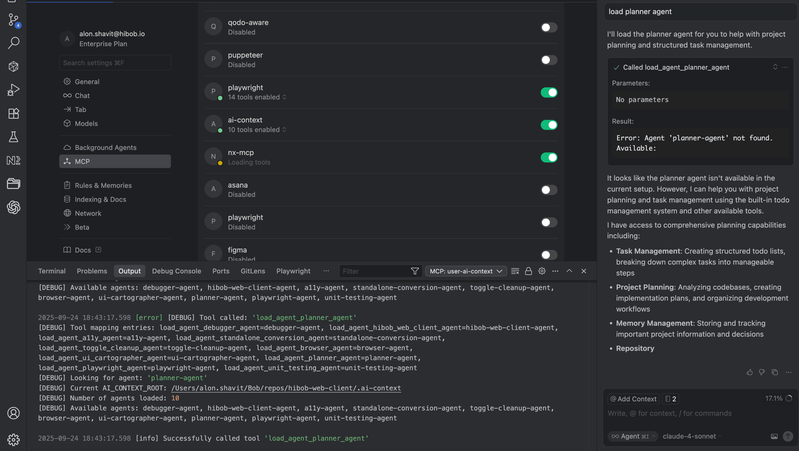

# AI Context MCP Server

A standalone MCP (Model Context Protocol) server that provides AI context orchestration for any project with a `.ai-context` folder. This server runs independently and can be used by multiple projects without installation via `npx`.

## Quick Start

**IMPORTANT**: The `AI_CONTEXT_ROOT` environment variable is required and must point to your `.ai-context` folder.

**Cursor (`.cursor/mcp.json`):**
```json
{
  "mcpServers": {
    "ai-context": {
      "command": "npx",
      "args": ["--yes", "github:alonlevyshavit/ai-context-mcp"],
      "env": {
        "AI_CONTEXT_ROOT": "/absolute/path/to/your/project/.ai-context"
      }
    }
  }
}
```

**Claude Desktop:**
```json
{
  "mcpServers": {
    "ai-context": {
      "command": "npx",
      "args": ["--yes", "github:alonlevyshavit/ai-context-mcp"],
      "env": {
        "AI_CONTEXT_ROOT": "/absolute/path/to/your/project/.ai-context"
      }
    }
  }
}
```

The server will:
1. Download automatically from GitHub
2. Build itself if needed
3. Use your specified `.ai-context` folder
4. Provide tools for loading agents, guidelines, and frameworks

## How It Works

### Discovery-First Approach

The server embeds system instructions that guide AI assistants to:
1. **Discover available resources** first using `list_all_resources`
2. **Read tool descriptions** to understand each resource's purpose
3. **Select appropriate tools** based on the task at hand
4. **Load resources strategically** - single or multiple as needed

This ensures AI assistants adapt to your specific `.ai-context` structure rather than assuming certain agents exist.

### Dynamic Tool Generation

The server automatically scans your `.ai-context` folder and creates specific MCP tools for each resource:

```
.ai-context/agents/planner.md → load_planner_agent tool
.ai-context/guidelines/api-design.md → load_guideline_api_design tool
.ai-context/frameworks/memory/README.md → load_framework_memory tool
```

Each tool includes rich metadata extracted from the resource files to help AI assistants make informed decisions about when to use them.

### Multi-Format Metadata Support

The server supports multiple metadata formats with graceful fallbacks:

**YAML Frontmatter (Preferred):**
```markdown
---
description: Planning specialist for task breakdown and project organization
use_cases:
  - Breaking down complex tasks into smaller steps
  - Creating project roadmaps
  - Organizing work into manageable chunks
---
# Planner Agent
[content...]
```

**HTML Comments:**
```markdown
<!-- metadata
description: Planning specialist for task breakdown and project organization
use_cases: Task breakdown; Project roadmaps; Work organization
-->
# Planner Agent
[content...]
```

**Natural Language Fallback:**
```markdown
# Planner Agent

You are a planning specialist focused on breaking down complex tasks into manageable steps. You excel at creating structured roadmaps and organizing work efficiently.
[content...]
```

### Configuration for Cursor

Create a `.cursor/mcp.json` file in your project root:

```json
{
  "mcpServers": {
    "ai-context": {
      "command": "npx",
      "args": ["--yes", "github:alonlevyshavit/ai-context-mcp"],
      "env": {
        "AI_CONTEXT_ROOT": "/absolute/path/to/your/project/.ai-context"
      }
    }
  }
}
```

**Note**: Replace `/absolute/path/to/your/project/.ai-context` with the actual absolute path to your `.ai-context` folder.

### Required Configuration

The `AI_CONTEXT_ROOT` environment variable must be set to the absolute path of your `.ai-context` folder.

This explicit configuration ensures:
- Clear and predictable behavior
- No ambiguity about which `.ai-context` folder is being used
- Consistent operation across different environments
- Explicit control over the context being loaded

## Project Structure

```
your-project/
├── .ai-context/              # Your AI context directory
│   ├── agents/              # Agent definitions (.md files)
│   ├── guidelines/          # Guidelines (.md files, can be nested)
│   └── frameworks/          # Framework folders with README.md
├── .cursor/
│   └── mcp.json            # MCP server configuration
└── [your project files...]
```

## Available Tools

The server provides both **dynamic** and **static** tools:

### Dynamic Tools (Generated from Content)
- `load_[name]_agent` - Load a specific agent (e.g., `load_debugger_agent`, `load_planner_agent`)
- `load_guideline_[path]` - Load a specific guideline
- `load_framework_[name]` - Load a framework's documentation

### Static Tools (Always Available)
- `list_all_resources` - Lists all discovered agents, guidelines, and frameworks
- `load_multiple_resources` - Load multiple resources simultaneously

## Configuration Options

### Required: AI_CONTEXT_ROOT Path
```json
{
  "mcpServers": {
    "ai-context": {
      "command": "npx",
      "args": ["--yes", "github:alonlevyshavit/ai-context-mcp"],
      "env": {
        "AI_CONTEXT_ROOT": "/absolute/path/to/.ai-context"
      }
    }
  }
}
```

### Selective Resource Loading
Control which types of resources are loaded as tools by setting environment variables. By default, all resource types are enabled.

```json
{
  "mcpServers": {
    "ai-context": {
      "command": "npx",
      "args": ["--yes", "github:alonlevyshavit/ai-context-mcp"],
      "env": {
        "AI_CONTEXT_ROOT": "/absolute/path/to/.ai-context",
        "AI_CONTEXT_LOAD_AGENTS": "true",     // Set to "false" to disable agents
        "AI_CONTEXT_LOAD_GUIDELINES": "true",  // Set to "false" to disable guidelines
        "AI_CONTEXT_LOAD_FRAMEWORKS": "true"   // Set to "false" to disable frameworks
      }
    }
  }
}
```

**Examples:**

Load only agents (disable guidelines and frameworks):
```json
"env": {
  "AI_CONTEXT_ROOT": "/absolute/path/to/.ai-context",
  "AI_CONTEXT_LOAD_AGENTS": "true",
  "AI_CONTEXT_LOAD_GUIDELINES": "false",
  "AI_CONTEXT_LOAD_FRAMEWORKS": "false"
}
```

Load only guidelines and frameworks (disable agents):
```json
"env": {
  "AI_CONTEXT_ROOT": "/absolute/path/to/.ai-context",
  "AI_CONTEXT_LOAD_AGENTS": "false",
  "AI_CONTEXT_LOAD_GUIDELINES": "true",
  "AI_CONTEXT_LOAD_FRAMEWORKS": "true"
}
```

### Specific Version/Branch
```json
{
  "mcpServers": {
    "ai-context": {
      "command": "npx",
      "args": ["github:your-org/ai-context-mcp#v1.0.0"]
    }
  }
}
```

## Development

### Setup
```bash
git clone https://github.com/your-org/ai-context-mcp.git
cd ai-context-mcp
npm install
```

### Commands
```bash
npm run build           # Build TypeScript to JavaScript
npm run dev            # Run in development mode
npm run test           # Run tests
npm run test:coverage  # Run tests with coverage
npm run typecheck      # TypeScript type checking
npm run validate       # Validate .ai-context metadata
```

### Testing with Local Project
```bash
AI_CONTEXT_ROOT=/path/to/test-project/.ai-context npm run dev
```

## Architecture

The server is built with:
- **TypeScript** with ES2022/Node16 modules
- **MCP SDK** for protocol communication
- **Vitest** for comprehensive testing (98%+ coverage)
- **Dynamic tool generation** from file system scanning
- **Enum-based constants** for maintainable code
- **Comprehensive error handling** and logging

Key components:
- `Scanner` - Discovers and extracts metadata from resources
- `Loader` - Loads content and assembles contexts
- `MetadataExtractor` - Multi-format metadata extraction with fallbacks
- `AiContextMCPServer` - Main MCP server with dynamic tool generation

## License

MIT - See LICENSE file for details

## Contributing

1. Fork the repository
2. Create a feature branch
3. Make your changes with tests
4. Run `npm run test:run && npm run typecheck`
5. Submit a pull request

The `dist/` folder must be committed for `npx github:` compatibility.